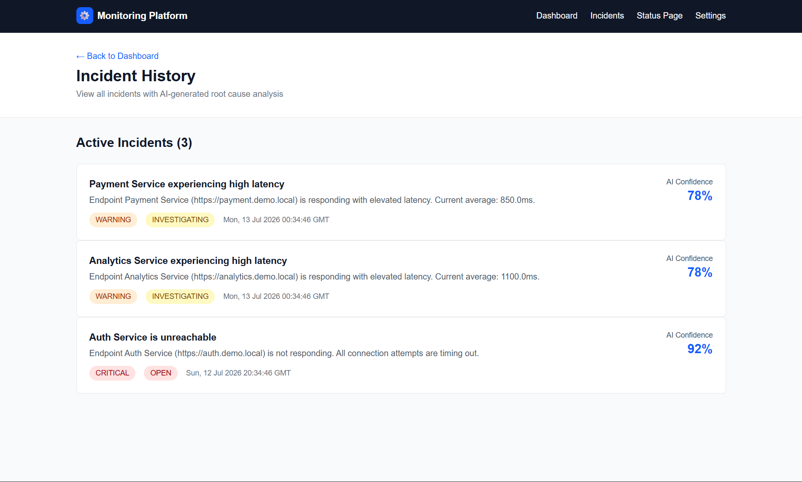
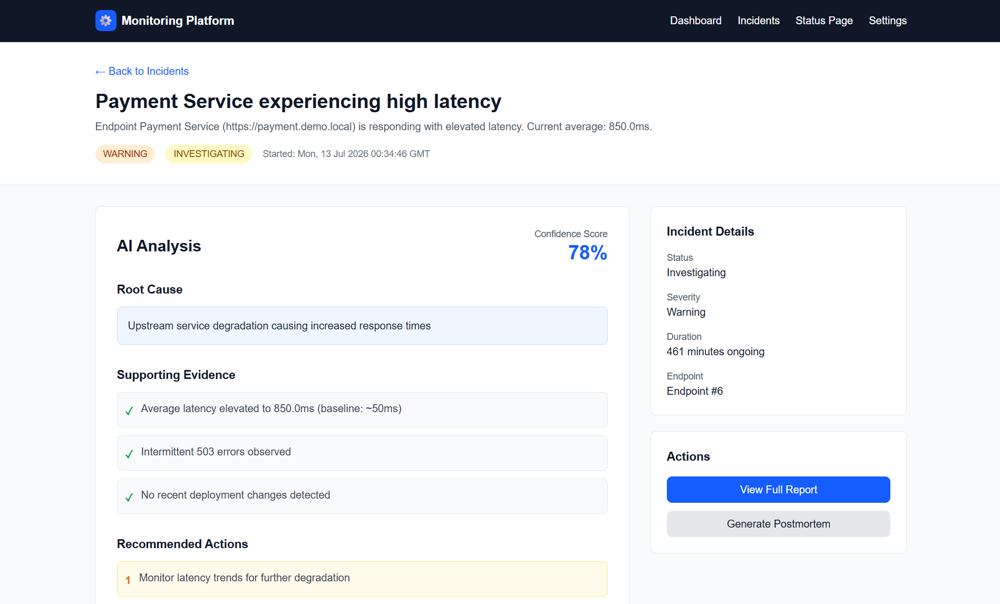
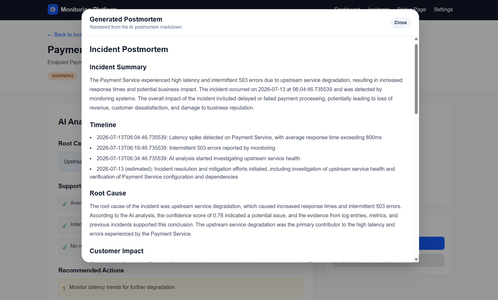
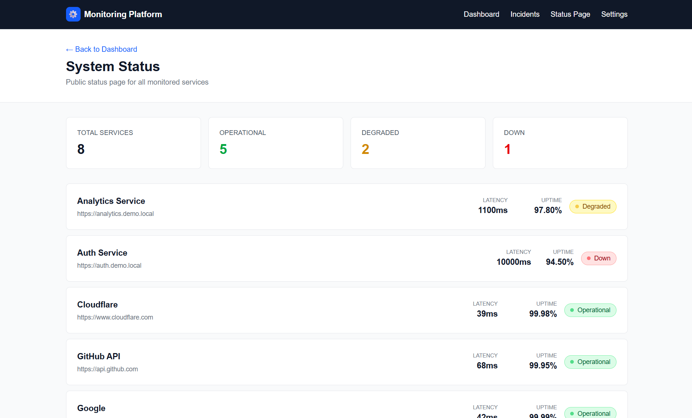
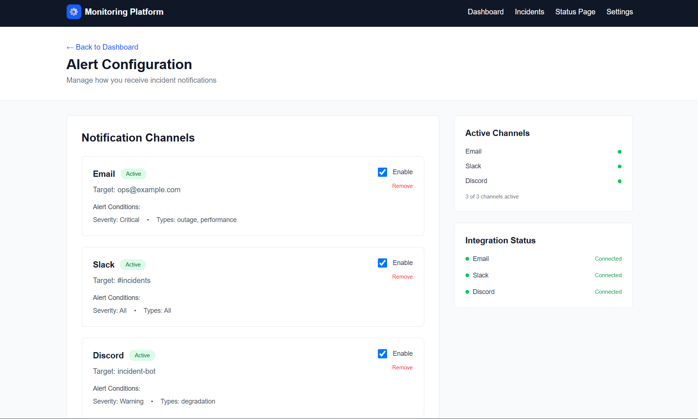

<div align="center">

# InfraMind

### AI-Powered Monitoring & Incident Intelligence Platform

[](LICENSE)
[](https://python.org)
[](https://nextjs.org)
[](https://fastapi.tiangolo.com)
[](https://groq.com)

*Continuously monitors endpoints, detects incidents, performs AI-powered root cause analysis, generates postmortems, and learns from historical incidents.*

---

</div>

## Overview

InfraMind transforms passive alerting into **active incident intelligence**. Instead of just telling you something is down, it tells you *why* it's down, *what* caused it, and *how* to fix it — powered by LLM reasoning over real-time and historical data.

The platform continuously monitors your endpoints, automatically detects and classifies incidents, performs deep root cause analysis using Groq's LLaMA 3.3 70B model, generates professional postmortem documents, and learns from every incident to improve future analysis.

## Features

### Monitoring

| Feature | Description |
|---------|-------------|
| **Endpoint Monitoring** | Track any HTTP endpoint with configurable check intervals |
| **Real-time Health Checks** | Automatic status code, latency, and uptime tracking |
| **Dashboard Metrics** | Total endpoints, operational/degraded/down counts, avg latency, active incidents |
| **Incident Detection** | Auto-creates incidents on failures, auto-resolves on recovery |
| **Status Page** | Public-facing service health overview with colored status badges |

### AI Intelligence

| Feature | Description |
|---------|-------------|
| **Root Cause Analysis** | LLM-powered diagnosis of why incidents occur |
| **Context-Aware Analysis** | Feeds logs, metrics, deployment info, and error details to the AI |
| **Historical Memory** | RAG-lite similarity matching against past incidents for pattern recognition |
| **Confidence Scoring** | AI provides confidence scores for its analysis |
| **Recommendations** | Actionable fix suggestions generated by the AI |
| **Report Generation** | Multi-format reports (JSON, Markdown, plain text) |
| **Postmortem Generation** | Full Markdown postmortem documents with timeline, impact, and lessons learned |

### Notifications

| Channel | Configuration |
|---------|---------------|
| **Email** | Target any email address with severity-based filtering |
| **Slack** | Target channels with `#channel` or `@user` |
| **Discord** | Target channels or webhooks |

All channels support per-channel severity filtering and incident type filtering.

### Frontend

| Page | Description |
|------|-------------|
| **Dashboard** (`/`) | Metrics grid, operational status, active incidents |
| **Incident History** (`/incidents`) | All incidents with AI confidence scores and severity badges |
| **Incident Detail** (`/incidents/[id]`) | Full AI analysis, evidence, timeline, and recommendations |
| **Status Page** (`/status`) | Public service health with real-time endpoint status |
| **Settings** (`/settings`) | Notification channel management, quiet hours, alert delay |

## Architecture

```
                          ┌─────────────────────┐
                          │   User / Browser     │
                          └──────────┬──────────┘
                                     │
                          ┌──────────▼──────────┐
                          │   Next.js Frontend   │
                          │   React 19 + Tailwind │
                          └──────────┬──────────┘
                                     │ REST API
                          ┌──────────▼──────────┐
                          │   FastAPI Backend     │
                          │   SQLAlchemy + Pydantic│
                          └──────────┬──────────┘
                    ┌────────────────┼────────────────┐
                    │                │                 │
          ┌─────────▼──────┐ ┌──────▼───────┐ ┌──────▼──────┐
          │ Monitoring      │ │ Incident     │ │ Notification │
          │ Engine          │ │ Service      │ │ Service      │
          │ (APScheduler)   │ │              │ │ (Email/Slack │
          │                 │ │              │ │  /Discord)   │
          └─────────┬──────┘ └──────┬───────┘ └──────────────┘
                    │                │
                    │       ┌────────▼────────┐
                    │       │   Groq AI API    │
                    │       │   LLaMA 3.3 70B  │
                    │       └────────┬────────┘
                    │                │
              ┌─────▼────────────────▼─────┐
              │        SQLite Database       │
              │  (endpoints, incidents,      │
              │   monitoring_results,        │
              │   timeline_events)           │
              └────────────────────────────┘
```

## Tech Stack

| Layer | Technology |
|-------|------------|
| **Frontend** | Next.js 16, React 19, TypeScript, Tailwind CSS v4 |
| **Backend** | FastAPI 0.115, SQLAlchemy 2.0, Pydantic v2, APScheduler |
| **AI Engine** | Groq SDK — LLaMA 3.3 70B Versatile |
| **Database** | SQLite (WAL mode, swappable to PostgreSQL) |
| **Deployment** | Vercel (Frontend), Render (Backend) |

## Project Structure

```
hackhazards/
├── backend/                              # FastAPI backend
│   ├── app/
│   │   ├── ai/                           # AI incident analysis module
│   │   │   ├── agent.py                  # Core LLM analysis logic
│   │   │   ├── groq_client.py            # Groq SDK singleton
│   │   │   ├── memory.py                 # RAG-lite historical similarity
│   │   │   ├── postmortem.py             # Postmortem document generator
│   │   │   ├── prompts.py               # System & user prompt templates
│   │   │   ├── report_generator.py       # Multi-format report output
│   │   │   ├── routes.py                 # /api/ai/* endpoints
│   │   │   └── schemas.py               # IncidentRequest, AIReport models
│   │   ├── api/                          # REST API routes
│   │   │   ├── dashboard.py              # GET /api/dashboard
│   │   │   ├── endpoints.py              # CRUD /api/endpoints
│   │   │   ├── incidents.py              # GET /api/incidents
│   │   │   ├── notifications.py          # CRUD /api/notifications
│   │   │   ├── integrations.py           # GET /api/integrations/*
│   │   │   ├── status.py                 # GET /api/status
│   │   │   └── users.py                  # User management
│   │   ├── core/
│   │   │   ├── config.py                 # Pydantic Settings
│   │   │   └── scheduler.py             # APScheduler monitoring loop
│   │   ├── db/
│   │   │   ├── database.py               # SQLAlchemy engine, sessions
│   │   │   └── seed.py                   # Demo data seeder
│   │   ├── models/                       # ORM models
│   │   │   ├── endpoint.py               # Endpoint
│   │   │   ├── incident.py               # Incident, TimelineEvent
│   │   │   └── monitoring_result.py      # MonitoringResult
│   │   ├── schemas/                      # Pydantic request/response
│   │   │   ├── endpoint.py
│   │   │   └── incident.py
│   │   ├── services/
│   │   │   ├── incident_service.py       # Incident lifecycle management
│   │   │   └── monitor.py               # HTTP health checks
│   │   └── main.py                       # App entrypoint
│   ├── requirements.txt
│   └── .env.example
│
├── monitoring-platform/                  # Next.js frontend
│   ├── app/                              # App Router pages
│   │   ├── page.tsx                      # Dashboard
│   │   ├── incidents/page.tsx            # Incident list
│   │   ├── incidents/[id]/page.tsx       # Incident detail
│   │   ├── status/page.tsx               # Public status page
│   │   └── settings/page.tsx             # Alert configuration
│   ├── components/                       # Reusable UI components
│   │   ├── badges.tsx                    # StatusBadge, SeverityBadge
│   │   └── endpoint-card.tsx            # EndpointCard
│   ├── lib/
│   │   └── backend.ts                    # API client (backendGet/Post/Put/Delete)
│   ├── types/index.ts                    # TypeScript interfaces
│   └── package.json
│
└── README.md
```

## AI Workflow

```
  Incident Detected
        │
        ▼
┌─────────────────────┐
│  Context Collection  │  Gather endpoint info, status code, latency,
│                     │  error messages, logs, deployment info
└──────────┬──────────┘
           │
           ▼
┌─────────────────────┐
│  Historical Memory   │  RAG-lite similarity search across past incidents
│  (memory.py)         │  Weighted field matching (endpoint, status, errors)
└──────────┬──────────┘
           │
           ▼
┌─────────────────────┐
│  Prompt Engineering  │  Build context-rich prompt with current + historical
│  (prompts.py)        │  incident data for the LLM
└──────────┬──────────┘
           │
           ▼
┌─────────────────────┐
│  Groq AI             │  LLaMA 3.3 70B Versatile — structured JSON output
│  (agent.py)          │  Root cause, confidence, evidence, recommendations
└──────────┬──────────┘
           │
     ┌─────┴─────┐
     ▼           ▼
  /analyze    /postmortem
  (JSON)      (Markdown document)
```

### Historical Memory (RAG-lite)

No vector database or external embeddings required. Similarity is computed via weighted field matching:

| Signal | Weight | Method |
|--------|--------|--------|
| Same endpoint URL | 40 | Exact match with partial-prefix fallback |
| Same HTTP status code | 20 | Exact match; half credit for same class (5xx) |
| Error message overlap | 15 | Jaccard token similarity |
| Same service name | 15 | Substring match in title/description |
| Similar latency range | 5 | Ratio-based; within 50% threshold |
| Same severity | 5 | Exact or adjacent severity match |

Top 3 matches are injected into the AI prompt. The system prompt instructs the LLM to compare the current incident with historical ones, identify patterns, and reference previous resolutions.

## Screenshots

> *Add screenshots of your running application here.*

## 📸 Dashboard


---

## 🚨 Incident History



---

## 🔍 Incident Details



---

## 🤖 AI Generated Postmortem



---

## 📈 System Status



---

## ⚙️ Alert Configuration




## API Reference

### Health

| Method | Path | Description |
|--------|------|-------------|
| GET | `/api/health` | API health check |

### Endpoints CRUD

| Method | Path | Description |
|--------|------|-------------|
| GET | `/api/endpoints` | List all monitored endpoints |
| POST | `/api/endpoints` | Add a new endpoint to monitor |
| PUT | `/api/endpoints/{id}` | Update endpoint name or URL |
| DELETE | `/api/endpoints/{id}` | Remove an endpoint |

### Dashboard

| Method | Path | Description |
|--------|------|-------------|
| GET | `/api/dashboard` | Aggregated metrics (totals, uptime, latency, incidents) |

### Incidents

| Method | Path | Description |
|--------|------|-------------|
| GET | `/api/incidents` | List all incidents (newest first) |
| GET | `/api/incidents/{id}` | Incident detail with timeline, evidence, recommendations |

### Status Page

| Method | Path | Description |
|--------|------|-------------|
| GET | `/api/status` | Public status data for all endpoints |

### Notification Channels

| Method | Path | Description |
|--------|------|-------------|
| GET | `/api/notifications` | List all notification channels |
| POST | `/api/notifications` | Create a new notification channel |
| PUT | `/api/notifications/{id}` | Update a notification channel |
| DELETE | `/api/notifications/{id}` | Delete a notification channel |
| GET | `/api/notifications/settings` | Get full notification settings |
| PUT | `/api/notifications/settings` | Update full notification settings |

### AI Analysis

| Method | Path | Description |
|--------|------|-------------|
| GET | `/api/ai/health` | AI service health check |
| POST | `/api/ai/analyze` | Analyze incident — returns `AIReport` JSON |
| POST | `/api/ai/report` | Generate formatted report (JSON/Markdown/text) |
| POST | `/api/ai/postmortem` | Generate full Markdown postmortem document |

### Example: AI Analysis

```bash
curl -X POST http://localhost:8000/api/ai/analyze \
  -H "Content-Type: application/json" \
  -d '{
    "incident_id": "INC-001",
    "endpoint": "https://api.example.com/payments",
    "status_code": 500,
    "latency": 5000.0,
    "error_message": "Connection pool exhausted",
    "logs": ["pool timeout at 5000ms", "max_connections reached"],
    "deployment_info": "v2.3.1 deployed 2026-07-10 10:00",
    "system_metrics": {"cpu": 95.0, "memory": 88.0},
    "service_name": "payment-api",
    "environment": "production"
  }'
```

**Response:**

```json
{
  "incident_id": "INC-001",
  "root_cause": "Connection pool exhaustion due to unbounded concurrent requests in v2.3.1",
  "confidence": 0.92,
  "evidence": [
    "Latency spike to 5000ms indicates pool timeout",
    "CPU at 95% suggests resource contention",
    "No connection pool configuration in v2.3.1 release notes"
  ],
  "recommended_fixes": [
    "Configure connection pool limits (max_connections=50)",
    "Add connection pool monitoring metrics",
    "Implement circuit breaker pattern"
  ]
}
```

### Example: Create Notification Channel

```bash
curl -X POST http://localhost:8000/api/notifications \
  -H "Content-Type: application/json" \
  -d '{
    "type": "slack",
    "target": "#alerts",
    "enabled": true,
    "conditions": {
      "severity": "critical",
      "incidentType": ["outage", "performance"]
    }
  }'
```

## Installation

### Prerequisites

- Python 3.11+
- Node.js 18+
- A [Groq API key](https://console.groq.com)

### Backend

```bash
cd backend

# Create virtual environment
python -m venv venv

# Activate
# Windows:
venv\Scripts\activate
# macOS/Linux:
source venv/bin/activate

# Install dependencies
pip install -r requirements.txt

# Configure environment
cp .env.example .env
# Edit .env and set GROQ_API_KEY
```

### Frontend

```bash
cd monitoring-platform

npm install
```

## Environment Variables

| Variable | Default | Description |
|----------|---------|-------------|
| `GROQ_API_KEY` | *required* | API key for Groq LLM |
| `MODEL_NAME` | `llama-3.3-70b-versatile` | Groq model to use |
| `DATABASE_URL` | `sqlite:///./hackazards.db` | Database connection string |
| `SCHEDULER_INTERVAL_SECONDS` | `10` | Monitoring check interval |
| `REQUEST_TIMEOUT_SECONDS` | `10` | HTTP request timeout |
| `UPTIME_WINDOW_HOURS` | `24` | Window for uptime calculation |
| `CORS_ORIGINS` | `["http://localhost:3000"]` | Allowed CORS origins |

## Running Locally

**1. Start the backend:**

```bash
cd backend
uvicorn app.main:app --reload --port 8000
```

Backend available at `http://localhost:8000`
Interactive docs at `http://localhost:8000/docs`

**2. Start the frontend:**

```bash
cd monitoring-platform
npm run dev
```

Frontend available at `http://localhost:3000`

**3. Open the dashboard:**

Navigate to `http://localhost:3000` to see the monitoring dashboard with demo data.

## Deployment

### Frontend → Vercel

```bash
cd monitoring-platform
vercel deploy
```

Set the `NEXT_PUBLIC_API_URL` environment variable to your backend URL.

### Backend → Render

1. Push your code to GitHub
2. Create a new Web Service on [Render](https://render.com)
3. Set the build command: `pip install -r requirements.txt`
4. Set the start command: `uvicorn app.main:app --host 0.0.0.0 --port $PORT`
5. Add environment variables: `GROQ_API_KEY`, `DATABASE_URL`

## Database Schema

```
┌──────────────────┐       ┌────────────────────────┐
│    endpoints      │       │   monitoring_results    │
├──────────────────┤       ├────────────────────────┤
│ id (PK)          │◄──────│ endpoint_id (FK)        │
│ name              │       │ id (PK)                 │
│ url               │       │ status_code             │
│ status            │       │ latency (ms)            │
│ uptime (%)        │       │ success (bool)          │
│ average_latency   │       │ checked_at              │
│ created_at        │       └────────────────────────┘
│ updated_at        │
└────────┬─────────┘
         │
         ▼
┌──────────────────┐       ┌──────────────────┐
│    incidents      │       │  timeline_events  │
├──────────────────┤       ├──────────────────┤
│ id (PK)          │◄──────│ incident_id (FK) │
│ endpoint_id (FK) │       │ id (PK)          │
│ title             │       │ timestamp         │
│ description       │       │ event             │
│ severity          │       │ type              │
│ status            │       └──────────────────┘
│ root_cause        │
│ confidence_score  │
│ evidence          │
│ recommendations   │
│ started_at        │
│ resolved_at       │
└──────────────────┘
```

### Status Rules

| Condition | Endpoint Status |
|-----------|-----------------|
| HTTP 200–399 | `up` |
| HTTP 400–499 | `degraded` |
| HTTP ≥ 500 | `down` |
| Timeout | `down` |
| Request failure | `down` |

## Future Enhancements

- [ ] Kubernetes & Docker container monitoring
- [ ] Prometheus & Grafana integration
- [ ] Multi-user authentication & RBAC
- [ ] Predictive incident detection with time-series analysis
- [ ] Vector database for enhanced historical memory
- [ ] Custom alert escalation policies
- [ ] Webhook integrations
- [ ] Mobile push notifications

## Team

| Name | Role |
|------|------|
| *Your Name* | Full-Stack & AI |
| *Team Member 2* | Backend & Infrastructure |
| *Team Member 3* | Frontend & Notifications |

## License

This project is licensed under the MIT License — see the [LICENSE](LICENSE) file for details.

---

<div align="center">

**Built with AI, for AI-driven infrastructure.**

</div>
